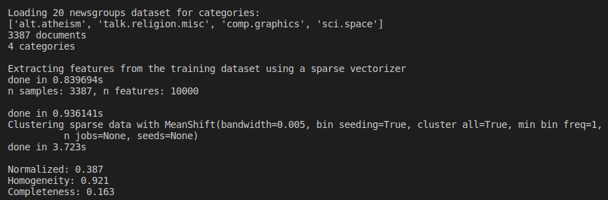
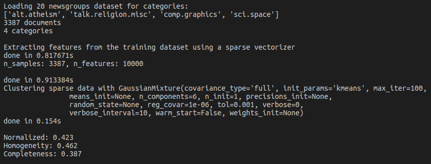

# Clustering Homework

本次实验测试了 sklearn 中 8 种聚类算法在 sklearn.datasets.load_digits 和 sklearn.datasets.fetch_20newsgroups 两个数据集上的聚类效果，分别是对数值和文档进行聚类分析。

## 1. K-Means

K-Means是最常见的一种聚类手段，它是一种迭代求解的聚类分析算法，其步骤是随机选取K个对象作为初始的聚类中心，然后计算每个对象与各个种子聚类中心之间的距离，把每个对象分配给距离它最近的聚类中心。

首次利用 K-Means 算法对digits 数据集进行聚类分析，结果如下：

K-Means 方法有不同的改进形式，可以看出聚类的结果不错，聚类的结果图如下：

可以看到在利用PCA对数据进行降维之后，聚类的可视化效果很好。

在利用K-Means对文本数据集进行聚类，使用了20个类中的4个类进行聚类，结果如下：

## 2. AffinityPropagation

AP算法的基本思想是将全部样本看做网络的节点，然后通过网络中各条边的消息传递计算出个样本的聚类中心。聚类过程中，共有两种消息在各节点间传递，分别是吸引度（responsibility）和归属度（availability）。AP算法通过迭代过程不断更新每一个点的吸引度和归属度，直到产生m个高质量的Exemplar（相当于质心），同时将其余的数据点分配到相应的聚类中。

利用 AP 算法对数据进行聚类，结果图如下：

对数据集进行可视化：

利用AP算法对文档数据集进行聚类，结果如下：

## Mean-Shift

Mean-Shift算法，又被称为均值漂移算法，与K-Means算法一样，都是基于聚类中心的聚类算法，不同的是，Mean-Shift算法不需要事先制定类别个数k。

利用Mean-shift算法对digits数据集进行聚类分析，结果如下：

对数据进行可视化，结果不是很好。

对文档数据集进行聚类，结果如下：

## Spectral clustering

 Spectral Clustering 谱聚类，是一种基于图论的聚类方法。将带权无向图划分为两个或两个以上的最优子图，使子图内部尽量相似，而子图间距离尽量距离较远，以达到常见的聚类的目的。它的主要思想是把所有的数据看做空间中的点，这些点之间可以用边连接起来。距离较远的两个点之间的边权重值较低，而距离较近的两个点之间的边权重值较高，通过对所有数据点组成的图进行切图，让切图后不同的子图间边权重和尽可能的低，而子图内的边权重和尽可能的高，从而达到聚类的目的。

利用谱聚类对digits数据集进行聚类，结果如下

对数据进行可视化的结果如下：

利用spectral clustering对文档数据集进行聚类的结果如下：

## Agglomerative clustering

Agglomerative clustering是自下而上的一种聚类算法。它首先将每个数据点视为一个单一的簇，然后计算所有簇之间的距离来合并簇，直到所有的簇聚合成为一个簇为止。

Agglomerative clustering聚类算法默认使用ward linkage方法。

利用Agglomerative clustering算法对digits数据集进行聚类，结果如下

对数据进行可视化如下：

对文档数据集进行聚类可得如下结果

## DBSCAN

DBSCAN是一种基于密度的空间聚类算法。该算法将具有足够密度的区域划分为簇，并在具有噪声的空间数据库中发现任意形状的簇，它将簇定义为密度相连的点的最大集合。通过将紧密相连的样本划为一类，这样就得到了一个聚类类别。通过将所有各组紧密相连的样本划为各个不同的类别，则我们就得到了最终的所有聚类类别结果。

利用DBSCAN对样本数据集进行聚类划分，结果如下

对划分结果进行可视化的下图，可以看到噪声点较多。

利用该算法对文档数据集进行聚类，结果不是很好

## Gaussian Mixture

使用高斯混合模型（GMM）做聚类首先假设数据点是呈高斯分布的，相对应K-Means假设数据点是圆形的，高斯分布（椭圆形）给出了更多的可能性。我们有两个参数来描述簇的形状：均值和标准差。所以这些簇可以采取任何形状的椭圆形，因为在x，y方向上都有标准差。因此，每个高斯分布被分配给单个簇。

利用高斯混合模型对数据集进行聚类，结果如下

对聚类结果进行可视化得下图

利用高斯混合模型对文档数据集进行聚类得到结果如下

### 总结

实验了这么多的聚类算法，我对于聚类的理解加深了很多，在实际使用中我们应该根据场景的不同，选择适合的聚类算法对数据进行聚类。没有一种聚类算法适合所有的情况，算法中的一些参数也需要在实验中慢慢去尝试，这样才能得到相对较优的解。